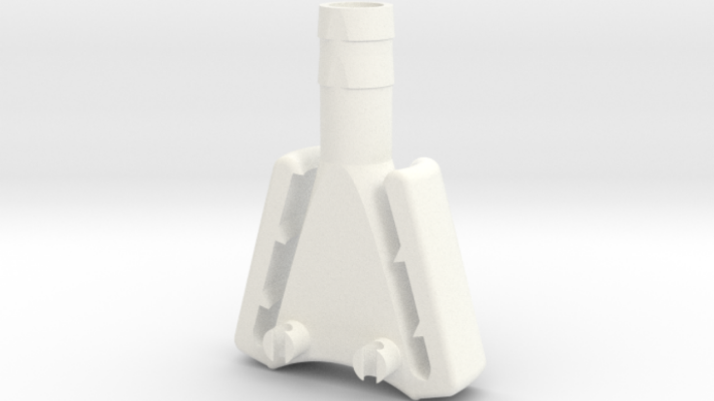

# Kohnspirator by Custom Surgical

This repository contains the 3D model of the kohnspirator, a piece to avoid lens fogging during eye surgery.

The system consists of only one part. In order to use it during surgery, simply connect it to a vacuum pump and place the wide end near the operation area. In the image below you can visualize the setup.

The 3D model of the part can be found in this repository under the "3D files" folder. you can download it and 3D print it using your preferred material.
If you don't have access to a 3D printer, you can also directly purchase it .

For special requests or suggestions, please do not hesitate to get in touch visiting us at .

